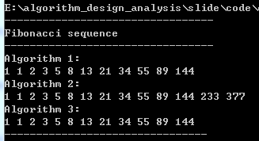

<ChapterOverviewSlide />

<style scoped>
.slidev-layout {
  padding: 0 !important;
}
</style>
---
layout: default
---

<IterAlgoIntroSlide />

<style scoped>
.slidev-layout {
  padding: 0 !important;
}
</style>

---
layout: default
---

<IterBasicSlide />

<style scoped>
.slidev-layout {
  padding: 0 !important;
}
</style>

---
layout: image
image: img/02.png
---

<div class="flex flex-col h-full justify-between py-10 px-12 text-black">
  
  <!-- 第一部分：标题与题目说明 -->
  <section class="flex-1">
    <h1 class="text-4xl font-bold border-b-2 border-amber-500 pb-2 mb-4">
      4.1.1 递推法：兔子繁殖问题
    </h1>
    <p class="text-xl leading-relaxed bg-gray-100 p-4 rounded-lg shadow-sm">
      一对兔子从出生后第三个月开始，每月生一对小兔子。小兔子到第三个月又开始生。假若兔子只生不死。
    </p>
  </section>

  <!-- 第二部分：按月演变流程 -->
  <section class="flex-1 flex flex-col justify-center">
    <div class="flex justify-around items-center text-2xl font-semibold bg-amber-50 py-6 rounded-xl border border-amber-200">
      <div class="text-center">1月<br><span class="text-amber-700">1对</span></div>
      <div class="text-gray-400">→</div>
      <div class="text-center">2月<br><span class="text-amber-700">1对</span></div>
      <div class="text-gray-400">→</div>
      <div class="text-center">3月<br><span class="text-amber-700">1+1=2对</span></div>
      <div class="text-gray-400">→</div>
      <div class="text-center">4月<br><span class="text-amber-700">2+1=3对</span></div>
      <div class="text-gray-400">→</div>
      <div class="text-center">5月<br><span class="text-amber-700">3+2=5对</span></div>
    </div>
  </section>

  <!-- 第三部分：数学模型与结构 -->
  <section class="flex-1 grid grid-cols-2 gap-8 items-start pt-4">
    <div class="bg-blue-50 p-5 rounded-lg border-l-4 border-blue-500">
      <h3 class="text-xl font-bold mb-2">数学模型</h3>
      <p class="text-lg font-serif">斐波那契数列 (Fibonacci):</p>
      <p class="text-xl mt-2">y1 = y2 = 1</p>
      <p class="text-xl">y_n = y_n-1 + y_n-2,(n = 3,4...)</p>
    </div>
    <div class="bg-green-50 p-5 rounded-lg border-l-4 border-green-500">
      <h3 class="text-xl font-bold mb-2">数据结构设计</h3>
      <ul class="list-disc list-inside text-lg space-y-2">
        <li>使用数组存储序列 y_n</li>
        <li>使用变量滚动更新y_n（节省空间）</li>
      </ul>
    </div>
  </section>

</div>

<style scoped>
/* 强制覆盖全局字体颜色为黑色 */
h1, h2, h3, p, li, div {
  color: #1a1a1a !important;
}

/* 调整公式大小 */
:deep(.katex) {
  font-size: 1.2rem !important;
}
</style>
---
layout: default
---

<AlgorithmSlide theme="indigo" badge="4.1.1" title="递推法" subtitle="Fibonacci 递推 &middot; 循环不变式" />

<style scoped>
.slidev-layout {
  padding: 0 !important;
}
</style>

---
layout: image
image: img/01.jpg
---

<div class="glass-root">

  <div class="title-area">
    <h1>算法 2：一次循环三步走</h1>
    <p>通过在单次循环中推进多个状态，有效减少循环次数。</p>
  </div>

  <div class="main-grid">
    <div class="code-col">
      <CodePanel :code="algo2Code" title="C 实现" />
    </div>
    <div class="info-col">
      <Card variant="blue" class="table-card">
        <h3>递推迭代表达式</h3>
        <table>
          <thead>
            <tr><td>1</td><td>2</td><td>3</td><td>4</td><td>5</td><td>6</td><td>7</td><td>8</td></tr>
          </thead>
          <tbody>
            <tr><td>a</td><td>b</td><td>c=a+b</td><td>a=b+c</td><td>b=a+c</td><td>c=a+b</td><td>a=b+c</td><td>b=a+c</td></tr>
          </tbody>
        </table>
      </Card>
      <div class="image-box">
        
      </div>
    </div>
  </div>

</div>

<script setup>
const algo2Code = "main() {\n  int i, a = 1, b = 1, c;\n  for(i = 1; i <= 4; i++) {\n    c = a + b;   // 第3个月\n    a = b + c;   // 第4个月\n    b = c + a;   // 第5个月\n    printf(\"%d %d %d \", c, a, b);\n  }\n}\n// 循环不变式组：c=a+b; a=b+c; b=c+a;\n// 依次循环递推了三步"
</script>

<style scoped>
.glass-root {
  width: 100%;
  height: 100%;
  padding: 3.5vh 4vw;
  box-sizing: border-box;
  display: flex;
  flex-direction: column;
  gap: 2vh;
  background: rgba(0, 0, 0, 0.45);
  backdrop-filter: blur(8px);
  color: #fff;
}

.title-area {
  text-align: center;
}

.title-area h1 {
  font-size: 2rem;
  font-weight: 700;
  margin: 0;
  color: #fff;
  text-shadow: 0 2px 10px rgba(0,0,0,0.6);
}

.title-area p {
  font-size: 1rem;
  margin: 0.4rem 0 0 0;
  color: rgba(255,255,255,0.85);
  text-shadow: 0 1px 6px rgba(0,0,0,0.5);
}

.main-grid {
  flex: 1;
  display: grid;
  grid-template-columns: 1fr 1fr;
  gap: 2.5vw;
  min-height: 0;
}

.code-col {
  min-height: 0;
}

.info-col {
  display: flex;
  flex-direction: column;
  gap: 2vh;
}

.table-card {
  background: rgba(255,255,255,0.92) !important;
  border-radius: 10px !important;
  padding: 0.8rem 1rem !important;
}

.table-card h3 {
  font-size: 0.9rem;
  font-weight: 700;
  color: #2563eb;
  margin: 0 0 0.5rem 0;
}

.table-card table {
  width: 100%;
  border-collapse: collapse;
  text-align: center;
  font-size: 0.75rem;
  color: #334155;
}

.table-card thead td {
  font-weight: 700;
  color: #1e293b;
  padding: 0.3rem 0.2rem;
  border-bottom: 1px solid #dde4ed;
}

.table-card tbody td {
  padding: 0.3rem 0.2rem;
  font-family: 'Fira Code', Consolas, monospace;
  font-size: 0.7rem;
}

.image-box {
  flex: 1;
  display: flex;
  align-items: center;
  justify-content: center;
  background: rgba(255,255,255,0.88);
  border-radius: 12px;
  padding: 1vh;
  min-height: 0;
}

.image-box img {
  max-width: 100%;
  max-height: 100%;
  object-fit: contain;
}

/* 代码紧凑化 */
.code-col :deep(.code-panel) {
  height: 100%;
}

.code-col :deep(code) {
  font-size: 0.78rem;
  line-height: 1.4;
}
</style>

---
layout: default
---

<div class="slide-root">
  <div class="slide-header">
    <h1>4.1.1 递推法</h1>
  </div>
  <div class="slide-grid">
    <div class="left-col">

```c
main( )
{  int i,a=1,b=1;
   print(a,b);
   for(i=1; i<=5;i++)
   {    a=a+b;       
        b=a+b;
        print(a,b);    
    }
}
```

  </div>
  <div class="right-col">
<div class="info-card card-blue">
  <h3>递推迭代表达式</h3>
  <p>1 &emsp; 2 &emsp; 3 &emsp; 4 &emsp; 5 &emsp; 6</p>
  <p>a &emsp; b &emsp; a=a+b &emsp; b=a+b &emsp; a=a+b &emsp; b=a+b</p>
</div>

<div class="info-card card-amber">
  <h3>循环不变式</h3>
  <p><b>a = a + b;&emsp; b = a + b;</b></p>
</div>


    </div>
  </div>
</div>

<style scoped>
.slide-root {
  width: 100%;
  height: 100%;
  display: flex;
  flex-direction: column;
  padding: 6vh 5vw;
  box-sizing: border-box;
  gap: 3vh;
  background: #f8fafc;
}

.slide-header h1 {
  font-size: 2.2rem;
  font-weight: 700;
  color: #1e293b;
  margin: 0;
  padding-bottom: 0.5rem;
  border-bottom: 3px solid #3b82f6;
  display: inline-block;
}

.slide-grid {
  flex: 1;
  display: grid;
  grid-template-columns: 1fr 1fr;
  gap: 3vw;
  min-height: 0;
}

.left-col {
  display: flex;
  flex-direction: column;
  gap: 2vh;
  overflow-y: auto;
}

.right-col {
  display: flex;
  flex-direction: column;
  gap: 2vh;
  overflow-y: auto;
  background: #fff;
  border-radius: 16px;
  box-shadow: 0 4px 20px rgba(0,0,0,0.06);
  padding: 2vh;
  margin-top: calc(-3.6rem - 3vh);
}

.code-image {
  max-width: 100%;
  max-height: 26vh;
  object-fit: contain;
  border-radius: 8px;
}

.info-card {
  background: #fff;
  border-radius: 12px;
  padding: 1rem 1.4rem;
  box-shadow: 0 2px 12px rgba(0,0,0,0.04);
  border-left: 4px solid;
}

.info-card h3 {
  font-size: 1.05rem;
  font-weight: 700;
  margin: 0 0 0.4rem 0;
}

.info-card p {
  font-size: 0.95rem;
  margin: 0.2rem 0;
  color: #334155;
  line-height: 1.6;
}

.card-blue {
  border-left-color: #3b82f6;
  background: linear-gradient(135deg, #eff6ff 0%, #fff 100%);
}
.card-blue h3 { color: #2563eb; }

.card-amber {
  border-left-color: #f59e0b;
  background: linear-gradient(135deg, #fffbeb 0%, #fff 100%);
}
.card-amber h3 { color: #d97706; }

:deep(pre) {
  background: #1e1e1e !important;
  border-radius: 12px;
  padding: 1rem 1.3rem !important;
  margin: 0;
}

:deep(code) {
  font-size: 0.9rem;
  line-height: 1.7;
}
</style>

---
layout: default
---

<GCDIntroSlide />

<style scoped>
.slidev-layout {
  padding: 0 !important;
}
</style>

---
layout: image
image: img/02.png
---

<GlassSlide
  title="递推法"
  subtitle="例2：求两个整数的最大公约数"
  :points="gcdPoints"
  :code="gcdCode"
  codeTitle="C 实现"
  imageSrc="./img/ans2.png"
/>

<script setup>
const gcdPoints = [
  { label: "算法思路", text: "短除法 / 辗转相除法" },
  { label: "数学模型", text: "gcd(m,n) = gcd(n, m mod n)" },
  { label: "不变式", text: "c = a mod b，a = b，b = c" }
]
const gcdCode = "main()\n{ int a, b;\n  input(a,b);\n  if(b=0)\n  {   print(\"data error\");\n      return;\n  }\n  else\n  {    c = a mod b;\n       while c<>0\n       {   a=b;b=c;\n           c=a mod b;\n       }\n  }\n  print(b);\n}"
</script>
---
layout: default
---

<BacktrackIntroSlide />

<style scoped>
.slidev-layout {
  padding: 0 !important;
}
</style>

---
layout: default
---

<AlgorithmSlide theme="orange" badge="4.1.2" title="倒推法" titleSub="猴子吃桃" titleIcon="&#x1F412;">
  <template #left>
    <div class="card" style="flex-shrink:0">
      <div class="card-glow"></div>
      <div class="card-inner">
        <div class="card-label"><span class="label-dot"></span>问题描述</div>
        <p class="problem-text">一只小猴子摘了若干桃子，每天吃现有桃的一半<strong>多一个</strong>，到<strong>第10天</strong>时就只剩下<strong>1个</strong>桃子了，求原有多少个桃？</p>
      </div>
    </div>
    <div class="card" style="flex:1;min-height:0">
      <div class="card-glow"></div>
      <div class="card-inner">
        <div class="card-label"><span class="label-dot algo-dot"></span>算法设计</div>
        <div class="formula-row">
          <span class="formula-tag">递推模型</span>
          <span class="formula-katex" v-katex="'a_i = (1 + a_{i+1}) \\times 2, \\quad i = 9,8,7,\\dots,1'"></span>
        </div>
        <div class="formula-row">
          <span class="formula-tag">循环不变式</span>
          <span class="formula-katex" v-katex="'a = (a + 1) \\times 2'"></span>
        </div>
        <div class="step-flow">
          <div class="step"><span class="step-num">D10</span><span class="step-desc">剩 1 个</span></div>
          <div class="step"><span class="step-num">D9</span><span class="step-desc">(1+1)×2 = 4</span></div>
          <div class="step"><span class="step-num">D8</span><span class="step-desc">(4+1)×2 = 10</span></div>
          <div class="step"><span class="step-num">D7</span><span class="step-desc">(10+1)×2 = 22</span></div>
          <div class="step"><span class="step-num">...</span><span class="step-desc">依此类推...</span></div>
          <div class="step"><span class="step-num">D1</span><span class="step-desc">1534 个桃子</span></div>
        </div>
      </div>
    </div>
  </template>
</AlgorithmSlide>

---
layout: image
image: img/01.jpg
---

<YanghuiSlide />

---
layout: default
---

<AlgorithmSlide theme="purple" badge="4.1.2" title="倒推法" titleSub="杨辉三角">
  <template #right>
    <div class="card image-card" style="flex:1;min-height:0">
      <div class="card-glow"></div>
      <div class="card-inner">
        <div class="card-label"><span class="label-dot img-dot"></span>输出结果</div>
        <div class="img-wrap"></div>
      </div>
    </div>
    <div class="card" style="flex-shrink:0">
      <div class="card-glow"></div>
      <div class="card-inner">
        <div class="card-label"><span class="label-dot out-dot"></span>杨辉三角</div>
        <pre class="output-text">1
1 1
1 2 1
1 3 3 1
1 4 6 4 1</pre>
      </div>
    </div>
  </template>
</AlgorithmSlide>

---
layout: image
image: img/01.jpg
---

<CardGridSlide badge="例 3" title="穿越沙漠问题">
  <template #left>
    <div class="card">
      <div class="card-head teal">问题描述</div>
      <div class="card-inner">
        <p>用一辆吉普车穿越1000公里的沙漠。吉普车的总装油量为500加仑，耗油率为1加仑/公里。由于沙漠中没有油库，必须先用这辆车在沙漠中建立临时油库。该吉普车以最少的耗油量穿越沙漠，应在什么地方建油库，以及各处的贮油量。</p>
      </div>
    </div>
    <div class="card">
      <div class="card-head amber">最省油的方案 (a &rarr; b)</div>
      <div class="card-inner">
        <ul class="strategy-list">
          <li>每次从a点加满油出发</li>
          <li>a-b之间来回奇数次，最后一次朝b点走</li>
          <li>a点储油量 = a-b之间耗油量 + b点储油量</li>
        </ul>
      </div>
    </div>
  </template>
  <template #right>
    <div class="card" style="flex:1">
      <div class="card-head blue">数学模型</div>
      <div class="card-inner">
        <p class="sec-label">定义变量：</p>
        <div class="var-list">
          <div class="var-item"><span class="var-sym">k</span>：从a加满油向b出发的次数</div>
          <div class="var-item"><span class="var-sym">2k-1</span>：a-b之间的来回次数</div>
          <div class="var-item"><span class="var-sym">x</span>：a-b之间的距离</div>
          <div class="var-item"><span class="var-sym">S_1</span>：a加油点的储油量</div>
          <div class="var-item"><span class="var-sym">S_2</span>：b加油点的储油量</div>
        </div>
        <p class="sec-label">关系式：</p>
        <div class="formula-box">
          <div class="formula-line">S_1 = 500 *k</div>
          <div class="formula-line">S_2 = S_1 - (2k-1)*x = 500k - (2k-1)*x</div>
        </div>
      </div>
    </div>
  </template>
</CardGridSlide>

---
layout: image
image: img/02.png
---

<CardGridSlide badge="4.1.2" title="倒推法">
  <template #left>
    <div class="card">
      <div class="card-head teal">变量定义</div>
      <div class="card-inner">
        <div class="var-list" style="gap:0.3rem;margin-bottom:0">
          <div class="var-item"><span class="var-sym">k: 从a加满油向b出发的次数</span></div>
          <div class="var-item"><span class="var-sym">2k-1: a-b之间的来回次数</span></div>
          <div class="var-item"><span class="var-sym">x: a-b之间距离</span></div>
          <div class="var-item"><span class="var-sym">S1: a加油点的储油量</span></div>
          <div class="var-item"><span class="var-sym">S2: b加油点的储油量</span></div>
        </div>
      </div>
    </div>
    <div class="card">
      <div class="card-head blue">数学模型</div>
      <div class="card-inner">
        <div class="formula-box">
          <div class="formula-line">S1 = 500k</div>
          <div class="formula-line">S2 = 500k - (2k-1)x</div>
        </div>
      </div>
    </div>
  </template>
  <template #right>
    <div class="card">
      <div class="card-head purple">算法设计：倒推法</div>
      <div class="card-inner">
        <div class="algo-steps">
          <div class="algo-step">
            <p class="step-title"><span class="var-sym">第一段：倒数第一个储油点到终点</span></p>
            <p class="step-formula"><span class="var-sym">k=1, S2=0, x=500, S1=500</span></p>
          </div>
          <div class="algo-step">
            <p class="step-title"><span class="var-sym">第二段：倒数2→1储油点</span></p>
            <p class="step-formula">k=2, S1=1000, x=500/3</p>
          </div>
          <div class="algo-step">
            <p class="step-title"><span class="var-sym">第三段：倒数3→2储油点</span></p>
            <p class="step-formula">k=3, S1=1500, x=500/5</p>
          </div>
          <div class="algo-step">
            <p class="step-title">第四段：...</p>
          </div>
        </div>
      </div>
    </div>
  </template>
</CardGridSlide>

---
layout: image
image: img/01.jpg
---

<AlgorithmSlide theme="desert" badge="4.1.2" title="沙漠穿越" subtitle="油料补给 · 倒推策略 · C 实现" />

<style scoped>
.slidev-layout {
  padding: 0 !important;
}
</style>


---
layout: default
---

<IterEquationIntroSlide />

<style scoped>
.slidev-layout {
  padding: 0 !important;
}
</style>

---
layout: default
---

<IterEquationSlide />

---
layout: default
---

<NewtonFormulaSlide />

<style scoped>
.slidev-layout {
  padding: 0 !important;
}
</style>

---
layout: default
---

<AlgorithmSlide theme="teal" badge="4.1.3" title="迭代法解方程" titleSub="牛顿迭代法">
  <template #left>
    <div class="card" style="flex-shrink:0">
      <div class="card-glow"></div>
      <div class="card-inner">
        <div class="card-label"><span class="label-dot"></span>求解方程</div>
        <div class="equation-box">
          <span class="eq-term">x</span><span class="eq-sup">3</span>
          <span class="eq-op"> + </span>
          <span class="eq-term">2x</span><span class="eq-sup">2</span>
          <span class="eq-op"> + </span>
          <span class="eq-term">3x</span>
          <span class="eq-op"> + </span>
          <span class="eq-term">4</span>
          <span class="eq-op"> = </span>
          <span class="eq-term">0</span>
        </div>
        <div class="eq-desc">x&#x2080; = 1，精度 1e-4</div>
      </div>
    </div>
    <div class="card image-card" style="flex:1;min-height:0">
      <div class="card-glow"></div>
      <div class="card-inner">
        <div class="card-label"><span class="label-dot img-dot"></span>函数图像</div>
        <div class="img-wrap"></div>
      </div>
    </div>
  </template>
  <template #right="{ code, codeLabel }">
    <div class="card code-card">
      <div class="card-glow"></div>
      <div class="card-inner">
        <div class="card-label"><span class="label-dot code-dot"></span>{{ codeLabel }}</div>
        <div class="code-window">
          <div class="code-dots"><span class="dot red"></span><span class="dot yellow"></span><span class="dot green"></span></div>
          <pre><code>{{ code }}</code></pre>
        </div>
      </div>
    </div>
  </template>
</AlgorithmSlide>

---
layout: default
---

<SlideLayout title="4.1.3 迭代法解方程" subtitle="例1：二分法求方程根">

<div class="grid grid-cols-2 gap-5">

<Card title="问题描述" variant="blue">

求解方程 **x³/2 + 2x² − 8 = 0** 在区间 **[0, 1]** 上的近似根

</Card>

<Card title="前提条件" variant="amber">

*f*(*x*) 在求解区间 *[a, b]* 上**连续**，且 *f*(*a*) 与 *f*(*b*) **异号**，即 *f*(*a*) · *f*(*b*) &lt; 0

</Card>

</div>

<h3 class="step-section-title">算法设计</h3>

<div class="step-list">

<Card :step="1">

**[a₀, b₀] = [a, b]**，**c₀ = (a₀ + b₀) / 2**
&middot; 若 *f*(c₀) = 0，则 c₀ 为方程的根
&middot; 若 *f*(a₀) · *f*(c₀) &lt; 0，则 [a₁, b₁] = [a₀, c₀]
&middot; 若 *f*(b₀) · *f*(c₀) &lt; 0，则 [a₁, b₁] = [c₀, b₀]

</Card>

<Card :step="2">

*f*(cₙ) = 0 时，或区间 [aₙ, bₙ] **足够小**，即认为找到了方程的根

</Card>

</div>

</SlideLayout>

<style scoped>
.step-section-title {
  font-size: 1.3rem;
  font-weight: 700;
  color: #334155;
  margin: 0;
  padding-left: 0.2rem;
}

.step-list {
  display: flex;
  flex-direction: column;
  gap: 1.2vh;
}
</style>
---
layout: default
---

<AlgorithmSlide theme="pink" title="方程求解" titleSub="二分逼近法" imageSrc="./img/ans7.png">
  <template #left="{ imageSrc }">
    <div class="card equation-card">
      <div class="card-glow"></div>
      <div class="card-inner">
        <div class="card-label"><span class="label-dot"></span>目标方程</div>
        <div class="equation-box">
          <span class="eq-term">3x</span><span class="eq-sup">3</span>
          <span class="eq-op"> + </span>
          <span class="eq-term">4x</span><span class="eq-sup">2</span>
          <span class="eq-op"> + </span>
          <span class="eq-term">2x</span>
          <span class="eq-op"> + </span>
          <span class="eq-term">8</span>
          <span class="eq-op"> = </span>
          <span class="eq-term">0</span>
        </div>
        <div class="eq-desc">区间 [0, 2] 内使用二分法迭代逼近求解</div>
        <div class="img-wrap"></div>
      </div>
    </div>
  </template>
  <template #right="{ code, codeLabel }">
    <div class="card code-card">
      <div class="card-glow"></div>
      <div class="card-inner">
        <div class="card-label"><span class="label-dot code-dot"></span>{{ codeLabel }}</div>
        <div class="code-window">
          <div class="code-dots"><span class="dot red"></span><span class="dot yellow"></span><span class="dot green"></span></div>
          <pre><code>{{ code }}</code></pre>
        </div>
      </div>
    </div>
  </template>
</AlgorithmSlide>
